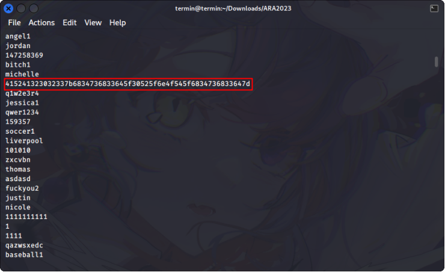

# SH4-32

## Description
Sze received an ecnrypted file and a message containing the clue of the file password from her friend.

The clue was a hash value : 9be9f4182c157b8d77f97d3b20f68ed6b8533175831837c761e759c44f6feeb8

Decrypt the file password!

[Attachment](./Challenge/Dictionary.txt)

## Solution

The first step to solve this challenge is to determine the hash type by using `hash-identifier`.

```shell
hash-identifier
```


Next, we use `hashcat` to try the dictionary attack against this hash value.

```shell
hashcat -m 1400 -a 0 "9be9f4182c157b8d77f97d3b20f68ed6b8533175831837c761e759c44f6feeb8" Dictionary.txt
```

The result showed no matching value was found, but there's a potfile. Use `--show` option on hashcat command to show the content of this potfile

```shell
$ hashcat -m 1400 -a 0 "9be9f4182c157b8d77f97d3b20f68ed6b8533175831837c761e759c44f6feeb8" Dictionary.txt --show
9be9f4182c157b8d77f97d3b20f68ed6b8533175831837c761e759c44f6feeb8:415241323032337b6834736833645f30525f6e4f545f6834736833647d
```

The `415241323032337b6834736833645f30525f6e4f545f6834736833647d` is like a hex encoding value. Let's try to decode it.

```shell
$ echo 415241323032337b6834736833645f30525f6e4f545f6834736833647d | xxd -r -p
ARA2023{h4sh3d_0R_nOT_h4sh3d}
```

### Alternate solution
It turns out that inside the `Dictionary.txt` file there's an obvious entry and pretty different than the other.



This entry is encoded using hex and if we decode it we found the flag.

```shell
$ echo 415241323032337b6834736833645f30525f6e4f545f6834736833647d | xxd -r -p
ARA2023{h4sh3d_0R_nOT_h4sh3d}
```

## Flag
`ARA2023{h4sh3d_0R_nOT_h4sh3d}`

