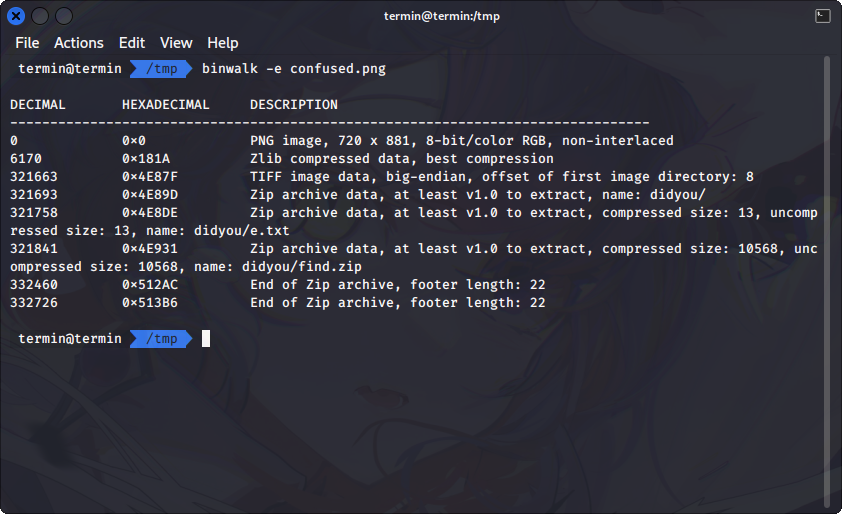
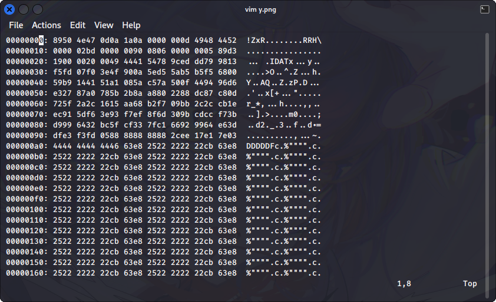

# Thinker

## Description
I always overthink about finding other part of myself, can you help me?

[Attachments](./Challenge/confused.png)

## Solution

The attachment file is a png file and you can actually use `binwalk` to extract more files.

``` shell
binwalk -e confused.png
```



After finishing the extraction process, you'll get the directory structure that looks like this.

``` shell
.
├── 181A
├── 181A.zlib
├── 4E89D.zip
└── didyou
    ├── e.txt
    └── find.zip
```

In the `didyou` directory there is an `e.txt` file containing text that has been encoded using base64 and when we decoded it the following results are obtained.

``` shell
$ cat e.txt | base64 -d
ARA2023{
```

Inside the `didyou` directory also have a `find.zip` file. After extracting this zip archive, there's a file called `a.txt` and the content is written using hex encoding. We can use [CyberChef](https://gchq.github.io/CyberChef/) to convert the hex encoding to ASCII.


The other file inside the `didyou/find` directory is a `something.zip` file. If you extract this file there'll be file called `s.txt` and the message is written using binary. If you convert the binary to ASCII you'll get the following result.


Then, inside the `didyou/find/something/` directory there's a `suspicious.zip` file. Extracting this file will give us a png file. But this is cannot be opened, we try to check using `exiftool` to check if there's a file format error.


Using `vim`, we can check the hex data of this png file. If you look at the image below, it'll show that the signature of this png file is incorrect, you can refer to this information on [Wikipedia](https://en.wikipedia.org/wiki/PNG#File_format). The incorrect signature is at byte 0-3 and its show as file signature or magic byte of PNG and byte 12-5 there're incorrect part at the IHDR chunk.


The corrected of hex data is shown in image below.



After we successfully recover the png file, if we open the file there's a message that are written using decimal number. If we convert the decimal number to ASCII we'll got the following result.


## Flag
`ARA2023{5!mpl3_C0rrupt3d_1m4ge5}`

