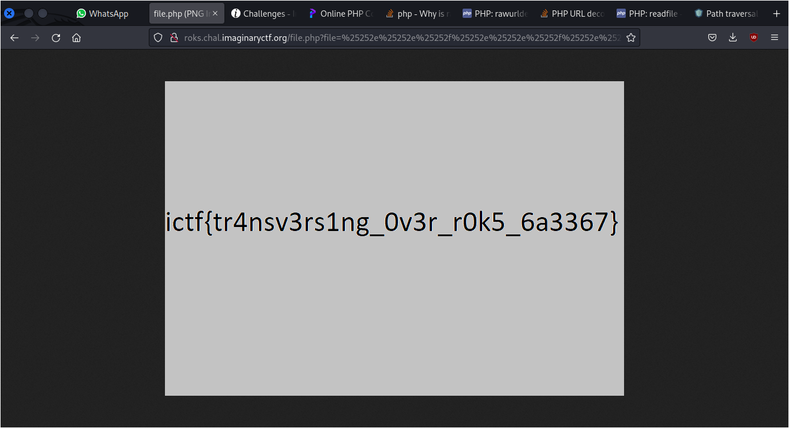

# roks

## Deskripsi
My rock enthusiast friend made a website to show off some of his pictures. Could you do something with it?

http://roks.chal.imaginaryctf.org/

## Attachment
[roks.zip](./Challenge/roks.zip)

## Solusi
Mari kita lihat file index.php yang terdapat pada attachment yang diberikan.
```php
<!DOCTYPE html>
<html>
<head>
    <title>rok gallery</title> </style>
    <link rel="stylesheet" type="text/css" href="styles.css"> 
</head>
<body>
    <h1>rok gallery</h1>
    
    <br><br>
    <button onclick="requestRandomImage()">get rok picture</button>
    <script>
        function requestRandomImage() {
	    var imageList = ["image1", "image2", "image3", "image4", "image5", "image6", "image7", "image8", "image9", "image10"]

            var randomIndex = Math.floor(Math.random() * imageList.length);
            var randomImageName = imageList[randomIndex];

            var xhr = new XMLHttpRequest();
            xhr.onreadystatechange = function () {
                if (xhr.readyState === 4 && xhr.status === 200) {
                    var blob = xhr.response;
                    var imageUrl = URL.createObjectURL(blob);
                    document.getElementById("randomImage").src = imageUrl;
                }
            };

            xhr.open("GET", "file.php?file=" + randomImageName, true);
            xhr.responseType = "blob";
            xhr.send();
        }
    </script>
</body>
</html>
```

File index.php tersebut akan menampilkan gambar yang terdapat pada variable `imageList` secara random.
Hal yang menarik adalah cara web tersebut mendapatkan gambar atau menampilkan gambar, yaitu dengan menggunakan GET method dengan url parameter seperti berikut `file.php?file=`. Kemungkinan kita bisa memanfaatkan Local File Inclusion (LFI) atau directory traversal untuk mendapatkan flag.

Selanjutnya ini adalah source code dari file.php
```php
<?php
  $filename = urldecode($_GET["file"]);
  if (str_contains($filename, "/") or str_contains($filename, ".")) {
    $contentType = mime_content_type("stopHacking.png");
    header("Content-type: $contentType");
    readfile("stopHacking.png");
  } else {
    $filePath = "images/" . urldecode($filename);
    $contentType = mime_content_type($filePath);
    header("Content-type: $contentType");
    readfile($filePath);
  }
?>
```
Berdasarkan code tersebut, url parameter yang dimasukkan akan didecode oleh program menggunakan fungsi `urldecode`. Kemudian terdapat filtering disini, yaitu jika dari url parameter yang dimasukkan mengandung `/` atau `.` maka kita tidak bisa mendapatkan flag. 
Mengubah karakter `/` atau `.` menggunakan url encoding juga tidak bisa dilakukan, karena url parameter yang kita masukkan akan di-decode oleh PHP menggunakan fungsi `urldecode`.
Awalnya dicoba untuk memasukkan payload menggunakan double URL encoding, namun masih tidak berhasil.

Digunakan referensi [berikut](https://security.stackexchange.com/questions/96736/path-traversal-filter-bypass-techniques) untuk membuat payload. Payload yang digunakan merupakan modifikasi dari double URL encoding, jika `%252e` akan di-decode menjadi `.` maka payload akan diubah menjadi berikut ini `%25252e`.
Saat `%25252e` di-decode menggunakan fungsi `urldecode` ini tidak akan langsung menjadi karakter `.` tetapi menjadi `%252e` yang masih berupa double URL encode dari karakter `.`. Kemudian `%252e` akan di-decode menggunakan fungsi `urldecode` lagi pada else condition sehingga akan menghasilkan karakter `.`.
Berikut ini adalah payload yang digunakan untuk mendapatkan flag
```
http://roks.chal.imaginaryctf.org/file.php?file=%25252e%25252e%25252f%25252e%25252e%25252f%25252e%25252e%25252f%25252e%25252e%25252fflag%25252epng
```

Berikut adalah tampilan dari flag.



## Flag
### ictf{tr4nsv3rs1ng_0v3r_r0k5_6a3367}