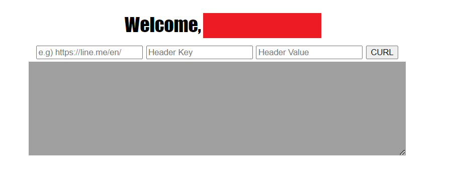
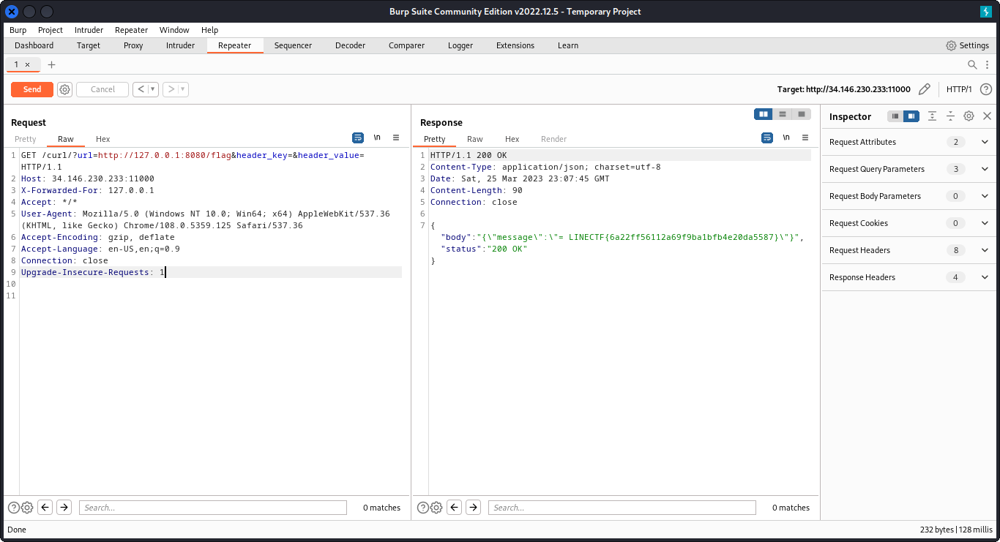

# Baby Simple GoCurl

## Description
Read the `/flag`

## Attachment
[baby-simple-gocurl_3e562770d3be9c9d047169c7b235281b.tar.gz](https://github.com/n1mdacybersec/CTF-Write-Up-Collection/blob/main/2023/LINE-CTF/Web/Baby%20Simple%20GoCurl/Challenge/baby-simple-gocurl_3e562770d3be9c9d047169c7b235281b.tar.gz)

## Solution
In this challenge, there's a source code of this challenge and we can try this challenge on our local machine. The appearance of this website is like this.



Here, if you look at the `main.go` file there's an object that shows the `HTTP GET` request method for `/curl` page.

```go
r.GET("/curl/", func(c *gin.Context) {
		client := &http.Client{
			CheckRedirect: func(req *http.Request, via []*http.Request) error {
				return redirectChecker(req, via)
			},
		}

		reqUrl := strings.ToLower(c.Query("url"))
		reqHeaderKey := c.Query("header_key")
		reqHeaderValue := c.Query("header_value")
		reqIP := strings.Split(c.Request.RemoteAddr, ":")[0]
		fmt.Println("[+] " + reqUrl + ", " + reqIP + ", " + reqHeaderKey + ", " + reqHeaderValue)

		if c.ClientIP() != "127.0.0.1" && (strings.Contains(reqUrl, "flag") || strings.Contains(reqUrl, "curl") || strings.Contains(reqUrl, "%")) {
			c.JSON(http.StatusBadRequest, gin.H{"message": "Something wrong"})
			return
		}

		req, err := http.NewRequest("GET", reqUrl, nil)
		if err != nil {
			c.JSON(http.StatusBadRequest, gin.H{"message": "Something wrong"})
			return
		}

		if reqHeaderKey != "" || reqHeaderValue != "" {
			req.Header.Set(reqHeaderKey, reqHeaderValue)
		}

		resp, err := client.Do(req)
		if err != nil {
			c.JSON(http.StatusBadRequest, gin.H{"message": "Something wrong"})
			return
		}

		defer resp.Body.Close()

		bodyText, err := ioutil.ReadAll(resp.Body)
		if err != nil {
			c.JSON(http.StatusBadRequest, gin.H{"message": "Something wrong"})
			return
		}
		statusText := resp.Status

		c.JSON(http.StatusOK, gin.H{
			"body":   string(bodyText),
			"status": statusText,
		})
	})
```

At a glance, what can be observed from the source code snippet above are:
- To access the `/flag` path your IP address must `127.0.0.1`.
- If our IP address is not `127.0.0.1` and our request contains `flag`, `curl`, or `%` the web application will shows an error.
- Send request by entering `url=http://127.0.0.1:8080/flag` will not give us a flag, because in the source code of the program use a `ClientIP()` function that will check our real IP address from the remote machine that accessed the web application. You can find the reference at this [link](https://pkg.go.dev/github.com/gin-gonic/gin#Context.ClientIP)
- The URL parameters of `header_key` and `header_value` must be empty

Now, let's take a look at this snippet of code. This code is handling the request to `/flag` path and it shows that the IP address is must to be `127.0.0.1` to accessed it.

```go
r.GET("/flag/", func(c *gin.Context) {
		reqIP := strings.Split(c.Request.RemoteAddr, ":")[0]

		log.Println("[+] IP : " + reqIP)
		if reqIP == "127.0.0.1" {
			c.JSON(http.StatusOK, gin.H{
				"message": flag,
			})
			return
		}

		c.JSON(http.StatusBadRequest, gin.H{
			"message": "You are a Guest, This is only for Host",
		})
	})
```

Based on the two previous of code, to obtain the flag, the IP address of our machine is must be set to `127.0.0.1`. For this challenge we can use `X-Forwarded-For: 127.0.0.1` HTTP header to tell the web server that we're accessing the server using IP address `127.0.0.1`. `X-Forwarded-For` is a HTTP header request to tell the web server about our originating IP address. This header is being used to tell the web server about the originating or real IP address when a client accessing the web server through a proxy server. The full explanation is in this [link](https://developer.mozilla.org/en-US/docs/Web/HTTP/Headers/X-Forwarded-For)

To solve this challenge is by sending a request of `HTTP GET` method with the following URL parameters and header.

```
GET /curl/?url=http:127.0.0.1:8080/flag&header_key=&header_value=" HTTP/1.1
Host: 34.146.230.233:11000
X-Forwaded-For: 127.0.0.1
```



## Flag
`LINECTF{6a22ff56112a69f9ba1bfb4e20da5587}`


