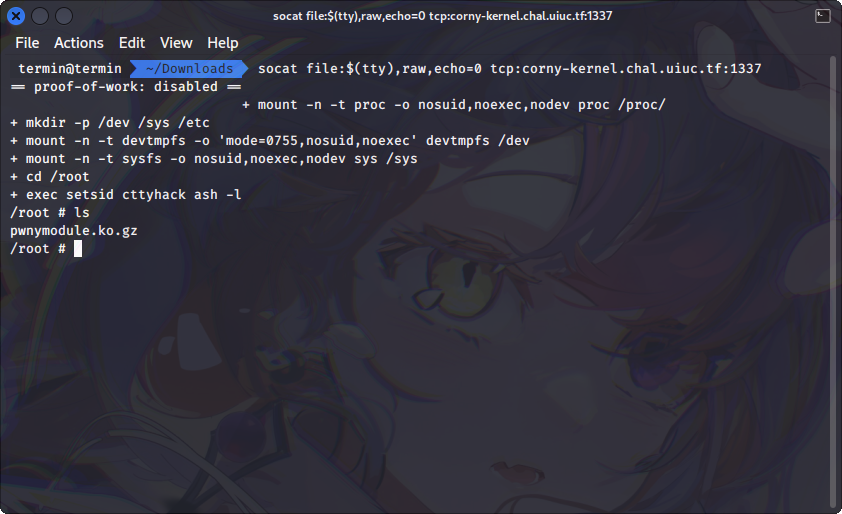
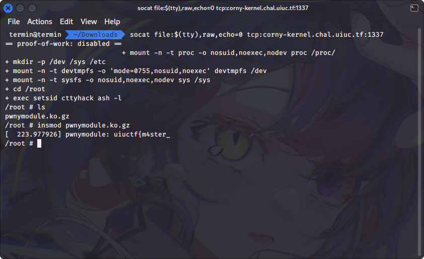
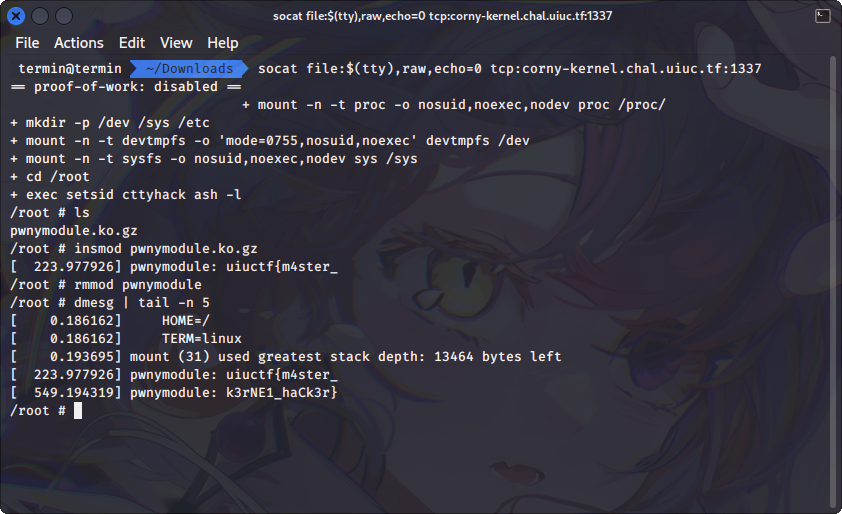

# Corny Kernel

## Deskripsi

Use our corny little driver to mess with the Linux kernel at runtime!

`$ socat file:$(tty),raw,echo=0 tcp:corny-kernel.chal.uiuc.tf:1337`

## Attachment
[pwnymodule.c](./Challenge/pwnymodule.c)

## Solusi

Jika kita melihat source code yang diberikan seperti berikut

```c
...
#define pr_fmt(fmt) KBUILD_MODNAME ": " fmt

#include <linux/module.h>
#include <linux/init.h>
#include <linux/kernel.h>

extern const char *flag1, *flag2;

static int __init pwny_init(void)
{
	pr_alert("%s\n", flag1);
	return 0;
}

static void __exit pwny_exit(void)
{
	pr_info("%s\n", flag2);
}

module_init(pwny_init);
module_exit(pwny_exit);
...
```

Source code yang diberikan adalah contoh sebuah module kernel yang ditulis menggunakan bahasa C untuk Linux. Terlihat 2 point penting dari source tersebut:
- Fungsi pwny_init() akan menampilkan potongan flag 1 saat module diload atau diinstall pada sistem
- Fungsi pwny_exit() akan menampilkan potongan flag 2 saat module di unload atau dihapus dari sistem

Saat terhubung ke sistem terdapat sebuah compressed kernel module `pwnymodule.ko.gz` seperti berikut ini.



Untuk menginstall kernel module tersebut digunakan perintah berikut. Hasilnya saat menjalankan command `insmod` akan didapatkan potongan flag yang pertama.

```
insmod pwnymodule.ko.gz
```



Saat diinstall, module akan menampilkan nama module saat sudah terinstall, yaitu `pwnymodule` dan potongan dari flag yang pertama.
Untuk menghapus kernel module tersebut dari sistem digunakan perintah berikut ini.

```
rmmod pwnymodule
```

Namun dari hasil menjalankan command tersebut tidak muncul potongan flag yang kedua.
Kita masih bisa menampilkan hasil dari fungsi `pwny_exit()` yang akan menampilkan potongan flag kedua pada saat module tersebut dihapus atau di unload dari sistem dengan mengamati output dari command `dmesg` yang digunakan untuk menampilkan seluruh pesan dari kernel ring buffer.

```
dmesg | tail -n 5
```

Hasilnya adalah seperti berikut ini.



## Flag
### uiuctf{m4ster_k3rNE1_haCk3r}