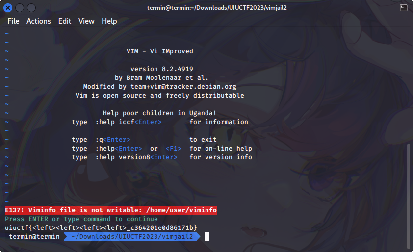

# vimjail2

## Deskripsi

Connect with `socat file:$(tty),raw,echo=0 tcp:vimjail2.chal.uiuc.tf:1337`. You may need to install socat.

## Attachment
[Dockerfile](./Challenge/Dockerfile)
[entry.sh](./Challenge/entry.sh)
[nsjail.cfg](./Challenge/nsjail.cfg)
[viminfo](./Challenge/viminfo)
[vimrc](./Challenge/vimrc)

## Solusi
Pertama mari kita lihat isi dari shell script `entry sh`

```sh
#!/usr/bin/env sh

vim -R -M -Z -u /home/user/vimrc -i /home/user/viminfo

cat /flag.txt
```

Shell script tersebut akan menjalankan command berikut:
- Menjalankan vim dengan read-only mode, not modifiable mode, restricted mode, menggunakan konfigurasi dari `/home/user/vimrc` dan informasi tambahan dari `/home/user/viminfo`
- Melihat isi dari `flag.txt`

Kemudian isi dari `vimrc` seperti berikut ini

```
set nocompatible
set insertmode

inoremap <c-o> nope
inoremap <c-l> nope
inoremap <c-z> nope
inoremap <c-\><c-n> nope

cnoremap a _
cnoremap b _
cnoremap c _
cnoremap d _
...

```

Isinya hampir mirip dengan challenge vimjail1, namun disini terdapat tambahan berupa perubahan mapping key untuk command, dimana karakter yang dimasukkan akan diubah menjadi `_`.
Sebagai contoh command `:view` akan berubah menjadi `:____`. Disini untuk karakter `q` dan `:` tidak termasuk dalam list untuk mapping yang diubah.

Untuk mendapatkan flag kita bisa menekan `Ctrl-\` dua kali dan diikuti dengan `Ctrl-o` (seharusnya ini adalah cara yang lebih intended untuk challenge vimjail1). 
Setelah menekan `Ctrl-o` tampilan insert mode yang awalnya `-- INSERT --` akan berubah menjadi `-- (insert) --`, jangan khawatir itu artinya bukan berarti kita tetap berada dalam insert mode, melainkan kita bisa menjalankan command sekali tetapi karena vim dijalankan sebagai read-only maka tampilannya adalah `-- (insert) --`.
Selanjutnya untuk command yang dijalankan adalah `:q`, yaitu untuk keluar dari vim. Hal itu karena jika kita melihat kembali pada `entry.sh` terdapat command `cat /flag.txt` yang akan langsung menampilkan isi flag.txt saat kita keluar dari vim.



## Flag
### `uiuctf{<left><left><left><left>_c364201e0d86171b}`