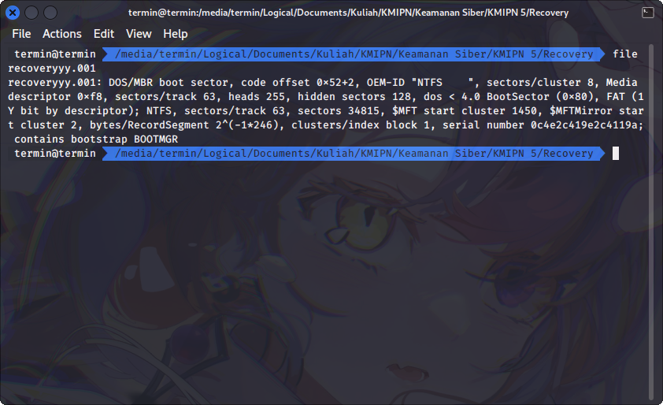
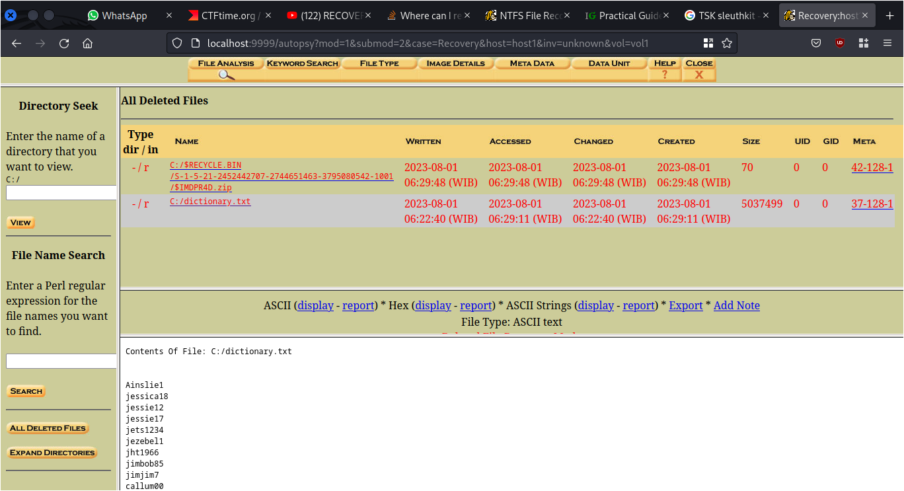
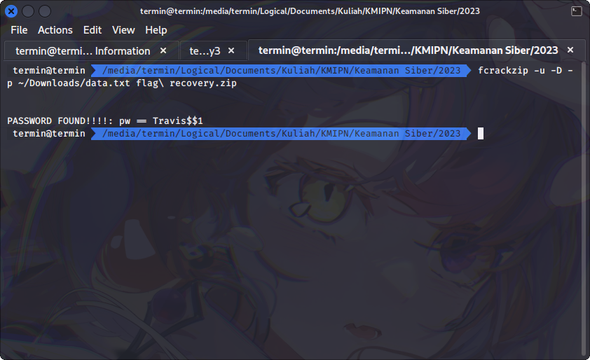
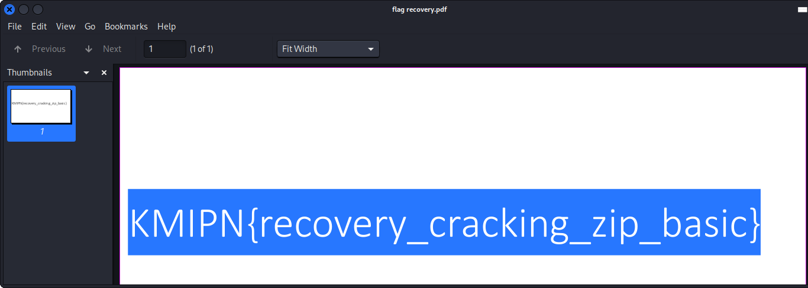

# Recovery

## Deskripsi
Penyimpanan Drive tersangka sudah di tanganin pihak keamanan.. dan Drive sudah
dijadikan file image, sesuai dengan proses penanganan forensic.

- Tetapi File yang dicari ternyata ber password.
- Menurut tersangka password ada di dalam wordlist yang sudah dia delete
- dapatkah kamu recovery file wordlist tersebut dan membuka file nya..

File download
https://drive.google.com/drive/folders/14IRms9sUNpFWjD7rX13Ia5Lv5ggMb9uG?usp=sharing

## Attachment
[recoveryyy.001](./Challenge/recoveryyy.001)

## Solusi
Karena tidak diketahui format file apa yang diberikan, maka digunakan command file untuk melihat jenis file tersebut.

```bash
file recoveryyy.001
```



Berdasarkan hasil dari command file diketahui bahwa file yang diberikan merupakan file disk NTFS. Kemudian dicoba untuk mount disk tersebut menggunakan command berikut

```bash
sudo mount -t ntfs -o stream_interfaces=windows "recoveryyy.001" "/tmp/mnt"
```

Setelah disk tersebut di-mount terdapat sebuah file zip yang didalamnya terdapat file PDF yang sudah dilock dan juga terdapat Recycle bin namun di dalam Recycle bin tersebut tidak terdapat informasi mengenai password yang bisa digunakan untuk membuka file PDF tersebut.

Dari deskripsi soal terdapat petunjuk untuk merecover wordlist yang bisa digunakan untuk bisa membuka file zip.

### Recover Wordlist menggunakan Command strings
Cara untuk merecover wordlist yang kami gunakan pada saat kompetisi KMIPN V sebenarnya cukup sederhana tapi sedikit sulit, yaitu digunakan command strings untuk melihat isi dari disk NTFS tersebut dan memilih secara manual dari output command strings yang terlihat seperti wordlist.

```bash
strings recoveryyy.001 | less
```


### Recover Wordlist menggunakan autopsy
Cara ini sebenarnya tidak digunakan ketika kompetisi KMIPN V, namun perlu ditambahkan karena membuat pekerjaan untuk melakukan recovery file yang sudah dihapus menjadi lebih mudah. 
Perlu diketahui bahwa ketika sebuah file dihapus secara permanen dari sebuah NTFS filesystem, file tersebut tidak akan dihapus, melainkan akan ditandai sebagai `unused` sehingga isi dari file tersebut bisa ditimpa atau ditulis ulang dengan sebuah file yang lain.
Penjelasan lengkap bisa melihat dari [Wiki Sleuthkit](https://wiki.sleuthkit.org/index.php?title=NTFS_File_Recovery).

Untuk mengembalikan file wordlist yang sudah dihapus, dilakukan file analysis menggunakan autopsy.
Untuk mendapatkan seluruh list file yang dihapus, bisa menggunakan menu `All Deleted Files`.
Seperti yang terlihat pada gambar di bawah terdapat file bernama `dictionary.txt` yang telah dihapus. Untuk melakukan recovery klik Export untuk mendownload file `dictionary.txt`.



Untuk resume penggunaan autopsy pada Linux bisa melihat video [YouTuber](https://www.youtube.com/watch?v=6NcIbiKhIis) berikut.


Setelah berhasil mendapatkan wordlist yang terdapat pada file recoveryyy.001, selanjutnya digunakan tool cracking zip `fcrackzip` untuk melakukan bruteforce password yang digunakan untuk mengunci file zip tersebut.

```bash
fcrackzip -u -D -p ~/Downloads/data.txt flag\ recovery.zip
```



Setelah di crack terdapat file PDF yang berisikan flag seperti berikut ini.



## Flag
### KMIPN{recovery_cracking_zip_basic}