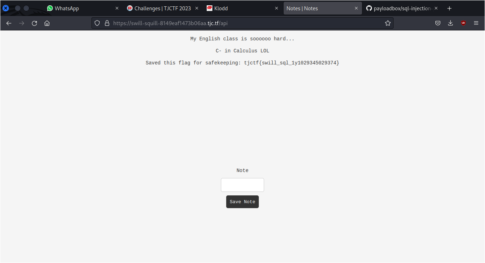

# swill-squill

## Deskripsi
ezsql

[Instancer](https://instancer.tjctf.org/challenge/swill-squill)

## Attachment
[server.zip](./Challenge/server.zip)

## Solusi
Source code yang diberikan dari challenge ini seperti di bawah ini.

```python
import html
from flask import Flask, request, render_template, redirect, make_response
import sqlite3
import jwt
import secrets
from functools import wraps

app = Flask(__name__)

app.static_folder = 'static'

flag = open('flag.txt', 'r').read()


def login_required():
    def _login_required(f):
        @wraps(f)
        def __login_required(*args, **kwargs):
            token = request.cookies.get('token')

            if not token:
                return redirect('/login')

            user = load_token(token)

            if not user:
                return redirect('/login')

            return f(*args, **kwargs, user=user)
        return __login_required
    return _login_required


def create_db():
    conn = sqlite3.connect(':memory:')
    c = conn.cursor()

    c.execute(
        'CREATE TABLE users (name text, grade text)')

    c.execute(
        'CREATE TABLE notes (description text, owner text)')

    c.execute('INSERT INTO users VALUES (?, ?)',
              ('admin', '12'))
    c.execute('INSERT INTO notes VALUES (?, ?)',
              ('My English class is soooooo hard...', 'admin'))
    c.execute('INSERT INTO notes VALUES (?, ?)',
              ('C- in Calculus LOL', 'admin'))
    c.execute('INSERT INTO notes VALUES (?, ?)',
              ("Saved this flag for safekeeping: "+flag, 'admin'))

    conn.commit()

    return conn


secret = secrets.token_urlsafe(32)

conn = create_db()


def generate_token(username):
    return jwt.encode({'name': username}, secret, algorithm='HS256')


def load_token(token):
    try:
        return jwt.decode(token, secret, algorithms=['HS256'])
    except:
        return None


@app.route('/', methods=['GET'])
def get_register():
    return render_template('register.jinja')


@app.route('/register', methods=['POST'])
def post_register():
    name = request.form['name']
    grade = request.form['grade']

    if name == 'admin':
        return make_response(redirect('/'))

    res = make_response(redirect('/api'))
    res.set_cookie("jwt_auth", generate_token(name))

    c = conn.cursor()
    c.execute("SELECT * FROM users WHERE name == '"+name+"';")

    if c.fetchall():
        return res

    c = conn.cursor()
    c.execute('INSERT INTO users VALUES (?, ?)',
              (name, grade))
    conn.commit()

    return res


@app.route('/api', methods=['GET'])
def api():
    name = load_token(request.cookies.get('jwt_auth'))['name']

    c = conn.cursor()

    string = "SELECT description FROM notes WHERE owner == '" + name + "';"
    c.execute(string)

    return render_template("notes.jinja", notes=[html.escape(a[0]) for a in c.fetchall()])


@app.route('/api', methods=['POST'])
def post_api():
    note = request.form['note']
    name = load_token(request.cookies.get('jwt_auth'))['name']

    c = conn.cursor()
    c.execute('INSERT INTO notes VALUES (?, ?)', (note, name))
    conn.commit()

    res = make_response(redirect('/api'))

    return res


if __name__ == '__main__':
    app.run(debug=True)
```

Jika dilihat dari source code yang diberikan terdapat vulnerability dari challenge ini. Saat menjalankan SQL query tidak terdapat sanitasi atau langkah pencegahan dari SQL injection, sehingga kita bisa memasukkan SQL query pada register form untuk membaca data milik `admin`.

Payload SQL injection yang digunakan adalah `' OR '1`. Untuk contoh lebih banyak payload dari SQL injection bisa melihat pada link [berikut](https://github.com/payloadbox/sql-injection-payload-list).



## Flag
### tjctf{swill_sql_1y1029345029374}
