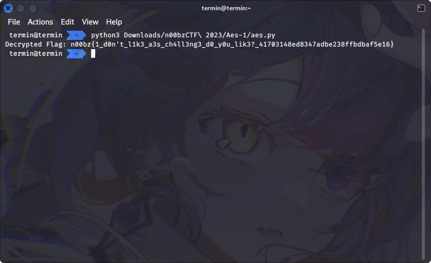

# Aes-1

## Deskripsi
My cousin-sister messaged me on Instagram that she has got some text `FOqxc90aMQZydCQb2MUm5tj4kRIxxVeCDWzAANfOrr8JItHYneUHhSV0awvQIo/8E1LtfYm/+VVWz0PDK6MXp38BWHoFDorhdS44DzYj9CQ=` and a text file in which something like String password: `aesiseasy` and Salt: `saltval` was writt,en can you help her to decode the weird text? Author: noob_abhinav

## Attachment
[enc.java](./Challenge/enc.java)

## Solusi
Source code yang diberikan pada challenge seperti berikut ini.

```java
import javax.crypto.Cipher;
import javax.crypto.SecretKey;
import javax.crypto.SecretKeyFactory;
import javax.crypto.spec.PBEKeySpec;
import javax.crypto.spec.SecretKeySpec;
import java.nio.charset.StandardCharsets;
import java.security.spec.KeySpec;
import java.util.Base64;

public class AESChallenge {
    private static final String AES_ALGORITHM = "AES";
    private static final String PBKDF2_ALGORITHM = "PBKDF2WithHmacSHA256";
    private static final int ITERATIONS = 10000;
    private static final int KEY_SIZE = 256;

    private static SecretKey generateKey(String password, byte[] salt) throws Exception {
        KeySpec spec = new PBEKeySpec(password.toCharArray(), salt, ITERATIONS, KEY_SIZE);
        SecretKeyFactory factory = SecretKeyFactory.getInstance(PBKDF2_ALGORITHM);
        SecretKey tmp = factory.generateSecret(spec);
        return new SecretKeySpec(tmp.getEncoded(), AES_ALGORITHM);
    }

    private static String encrypt(String plainText, SecretKey key) throws Exception {
        Cipher cipher = Cipher.getInstance(AES_ALGORITHM);
        cipher.init(Cipher.ENCRYPT_MODE, key);
        byte[] encryptedBytes = cipher.doFinal(plainText.getBytes(StandardCharsets.UTF_8));
        return Base64.getEncoder().encodeToString(encryptedBytes);
    }

    public static void main(String[] args) {
        String flag = "REDACTED";
        String password = "aesiseasy";
        byte[] salt = "saltval".getBytes(StandardCharsets.UTF_8);

        try {
            SecretKey key = generateKey(password, salt);
            String encryptedFlag = encrypt(flag, key);
            System.out.println("Encrypted Flag: " + encryptedFlag);
        } catch (Exception e) {
            e.printStackTrace();
        }
    }
}
```

Dari script tersebut kita tahu bahwa flag dienkripsi menggunakan algoritma AES dengan PBDKF2 HMAC-SHA256. 
Password yang digunakan adalah `aesiseasy` dan salt yang digunakan adalah `saltval`. Password dan salt digunakan untuk membuat key yang digunakan untuk mengenkripsi flag.

Program Python di bawah ini akan mencoba untuk mendapatkan key yang berasal dari kombinasi password dan salt dan kemudian melakukan dekripsi terhadap pesan yang telah dienkripsi.

```python
from cryptography.hazmat.primitives.ciphers import Cipher, algorithms, modes
from cryptography.hazmat.primitives import hashes
from cryptography.hazmat.primitives.kdf.pbkdf2 import PBKDF2HMAC
from cryptography.hazmat.backends import default_backend
import base64

def decrypt(ciphertext, password, salt):
    # Decode the Base64-encoded ciphertext
    ciphertext = base64.b64decode(ciphertext)
    
    # Derive the encryption key using PBKDF2 with HMAC-SHA256
    kdf = PBKDF2HMAC(
        algorithm=hashes.SHA256(),
        length=32,
        salt=salt,
        iterations=10000,
        backend=default_backend()
    )
    key = kdf.derive(password.encode())
    
    # Decrypt the ciphertext using AES
    cipher = Cipher(algorithms.AES(key), modes.ECB(), backend=default_backend())
    decryptor = cipher.decryptor()
    decrypted_bytes = decryptor.update(ciphertext) + decryptor.finalize()
    
    # Convert the decrypted bytes to a string
    decrypted_text = decrypted_bytes.decode('utf-8')
    
    return decrypted_text

if __name__ == "__main__":
    ciphertext = "FOqxc90aMQZydCQb2MUm5tj4kRIxxVeCDWzAANfOrr8JItHYneUHhSV0awvQIo/8E1LtfYm/+VVWz0PDK6MXp38BWHoFDorhdS44DzYj9CQ="  # Replace with the encrypted flag from Java
    password = "aesiseasy"
    salt = b"saltval"

    decrypted_flag = decrypt(ciphertext, password, salt)
    print("Decrypted Flag:", decrypted_flag)
```

Saat dijalankan program tersebut akan menghasilkan output seperti berikut ini.



## Flag
### n00bz{1_d0n't_l1k3_a3s_ch4ll3ng3_d0_y0u_lik3?_41703148ed8347adbe238ffbdbaf5e16}